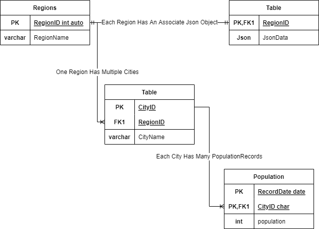

# Database Class 2022
## Practice 4 Notes
<b>Mann\_Fjöldi\_a\_islandi.csv Has Been modified slightly to make it easier to read from python and construct the json object that is shown below</b>

```json
{
	"Region_id":[{
		"city_id":'',
		"city_name":'',
		"city_population":[{
			"record_date":'',
			"population":''
		}]
	}]
}
```
### Python Scripts
The [CSV-Test](https://github.com/Frillion/mysqlDatabases2022/blob/main/Practice4/APIS/CSV-Test.py) file is the script that takes a file path to the csv file and imports that to the database **Requires:**[CSV\_Import](https://github.com/Frillion/mysqlDatabases2022/blob/main/Practice4/APIS/CSV_Import.py)

---
### Database Diagram



---
### Mysql Files

populationTracker creates the database and all its tables<br>
populationtracker inserts holds all the stored procedures that are required to insert the json data it gets from csv-test/csv\_Import<br>
population\_tracker\_operations holds the stored procedures for all data that the database should return

## Practice 5
### Relational Diagram

This is the relationship diagram for a database meant to be a question and answer site akin to stack overflow.

### MySQL Files
The name that i have decided on for the database is stack_definitively_not_overflowing cause as you might know i am very original \*cough\*\*cough\*<br>
Therefore the file containing the creation of the database is named as such.<br>
The file containing all the CRUD operations is called stack_not_overflowing_data.sql(**This Includes "Posting" Questions And Answers**)<br>
stack_not_overflowing_special_operations.sql has all other procedures needed by the database<br>
stack_not_overflowing_test has all of the create procedures which now work

### Procedures
<b>Create_User(json_object json)</b><br>
inserts a user to the users table with a json object input *see json objects below*<br>
*note: in this case i used a random 5byte base64 string( also for all ids that are not from supporting tables e.g. userstatuses)*
```json
{
	"user_id":"hDap6dc=",
	"status":"Active",
	"user_type":"Beginner",
	"username":"Julian Oliver",
	"password":"hoover",
	"email":"julian.oliver@example.com"
}
```
*note: the password would be encrypted*<br>
--------
<b>Create_Topic(json_object json)</b><br>
inserts a topic to the topics table with a json object input *see format below*
```json
{
	"topic_id":0,
	"topic_name":"Programming"
}
```
--------
<b>Create_Answer(json_object json)</b><br>
inserts an answer "posted" by some user and under a sqecific question into the answers table with a json object input *see format below*
```json
{
	"poster":"Julian Oliver",
	"answer_id":"y1Geya4=",
	"question_id":"tY9Gyio=",
	"contents":"Lorem ipsum dolor sit amet, consectetur adipiscing elit. Phasellus vitae aliquet sem. Quisque porta eleifend metus, non convallis turpis volutpat sit amet.Class aptent taciti sociosqu ad litora torquent per conubia nostra, per inceptos himenaeos."
}
```
--------
<b>Create_Access(json_object json)</b><br>
inserts a user type into the accessLevel table with a json object input *see format below*
```json
{
	"access_id":0,
	"access_level":"Admin"
}
```
--------
<b>Create_Question(json_object json)</b><br>
inserts a question "posted" by some user into the questions table with a json object input *see format below*
```json
{
	"poster":"Julian Oliver",
	"question_id":"gfVyuyw=",
	"topic":"Programming",
	"title":"Aliquam erat volutpat. Suspendisse lorem arcu, blandit non diam eget, eleifend aliquam purus. Quisque nec leo a dolor auctor auctor quis vehicula massa.",
	"description":"Lorem ipsum dolor sit amet, consectetur adipiscing elit. Sed turpis felis, luctus quis odio sed, rhoncus egestas nibh.Quisque tempus, ante ut egestas finibus, ante risus ullamcorper metus, porttitor congue ipsum purus eu neque. Ut massa metus, suscipit et tincidunt non, gravida ac lacus. Fusce in fringilla mi, ut tincidunt nunc. Praesent ornare semper ipsum a luctus.Suspendisse potenti.Quisque laoreet pretium semper. Curabitur convallis in mi vel sodales. Nam massa turpis, porta sit amet sem nec, iaculis ultricies nulla. Nam et varius enim. Praesent volutpat malesuada nisi, a ultricies risus aliquet non."
}
```
--------
<b>Create_Ratings(json_object json)</b><br>
inserts a rating from 1-10 for an answer into the ratings table with a json object input *see format below*
```json
{
	"user_id":"hDap6dc=",
	"answer_id":"y1Geya4=",
	"rating":8
}
```
*note: inputing a rating of the users own answer will not work*<br>
--------
<b>Create_Status(json_object json)</b><br>
inserts a status into the status table with a json object input *see format below*
```json
{
	"status_id":0,
	"user_status":"Active"
}
```
--------
<b>Get_User(user_name varchar(75))</b><br>
gets a singular user based on username and puts the data in a json object *see format at Get_Users*

--------
<b>Get_Users()</b><br>
gets all users and puts each users json object into a json array *see format below*
```json
{
	"user_id":"hDap6dc=",
	"username":"Julian Oliver",
	"status":"Active",
	"user_type":"Admin",
	"hased_password":"SHA2(hoover)",
	"email":"julian.oliver@example.com",
	"last_logon_date":"2022/05/01"
}
```
--------
<b>Get_Topic(topic_id int)</b><br>
gets a singular topic based on id and puts all info into a json object *see format at Get_Topics*

--------
<b>Get_Topics()</b><br>
gets all topics and puts each of their json objects into a json array *see format below*
```json
{
	"topic_id":0,
	"topic":"Programming"
}
```
--------
<b>Get_Question_Answers(question_id varchar(20))</b><br>
gets all answers "posted" under a specific question based on the questions id and puts all of the json objects in a json array *see format below*
```json
{
	"answer_id":"y1Geya4=",
	"question_id":"gfVyuyw=",
	"contents":"Lorem ipsum dolor sit amet, consectetur adipiscing elit. Praesent sed tempus metus. Nunc tempus condimentum euismod. Fusce blandit vel eros in ultricies. Aliquam placerat dapibus lorem nec vulputate.Praesent fermentum elit arcu, quis tincidunt velit sodales at. Cras ac convallis justo.Fusce rhoncus libero quis accumsan ornare. Mauris eget facilisis nisl."
	"date_posted":"2022/03/01"
}
```
--------
<b>Get_Access(access int)</b><br>
gets a user type/accessLevel based on its id and puts it into a json object *see format at Get_Access_All()*

--------
<b>Get_Access_All()</b><br>
gets all user types/accessLevels and puts each json object into a json array *see format below*
```json
{
	"access_id":0,
	"access_id":"Admin"
}
```
--------
<b>Get_Questions()</b><br>
gets all questions and puts each json object into a json array *see format below*
```json
{
	"question_id":"gfVyuyw=",
	"topic":"Programming",
	"poster":"Julian Oliver",
	"question":"Nunc accumsan ligula ac luctus tempus. Sed euismod accumsan gravida. Sed convallis ipsum eget nibh euismod commodo.Ut bibendum, risus tempus mattis accumsan, massa leo tincidunt velit, quis euismod nulla ligula ac lectus.",
	"description":"Mauris hendrerit ac velit ac porta. Cras ultricies, urna ut luctus porta, massa metus feugiat ante, consectetur lacinia ante libero sit amet tortor. Pellentesque ut nisi lacus. Mauris pellentesque nisi massa,ut volutpat justo dignissim vitae. In hac habitasse platea dictumst. Duis efficitur sapien sed rutrum condimentum.Morbi imperdiet hendrerit rutrum. Vivamus elit velit, mollis eu mattis eu, blandit et diam",
	"date_posted":"2022/01/15"
}
```
--------
<b>Get_Ratings(asnwer_id varchar(20))</b><br>
gets all ratings for a particular answer based on the answers id and puts each json object into a json array *see format below*
```json
{
	"rater_id":"hDap6dc=",
	"answer_id":"y1Geya4=",
	"rating":8
}
```
--------
<b>Get_Status(status_id int)</b><br>
gets a single user status based on its id and puts it in a  json object *see format at Get_Statuses*

--------
<b>Get_Statuses()</b><br>
gets all user statuses and puts each json object into a json array *see format below*
```json
{
	"status_id":0,
	"user_status":"Active"
}
```
--------
<b>Update_User_All(json_object json)</b><br>
updates all fields(except for the id) in the users table based on id. if any duplicate uniques between the new data and the old are found they are thrown out. input is a json object *see format below*
```json
{
	"user_id":"hDap6dc=",
	"username":"(new_username)",
	"password":"(new_password)",
	"email":"(new_email)"
}
```
--------
<b>Update_Topic_All(json_object json)</b><br>
updates all fields(except for the id) in the topics table based on id. if any duplicate uniques between the new data and the old are found they are thrown out. input is a json object *see format below*
```json
{
	"topic_id":0,
	"topic":"(new_topic)"
}
```
--------
<b>Update_Answer_All(json_object json)</b><br>
updates all fields(except for all ids) in the answers table based on id. input is a json object *see format below*
```json
{
	"answer_id":"y1Geya4=",
	"contents":"(updated_answer)"
}
```
--------
<b>Update_Access_All(json_object json)</b><br>
updates all fields(except for the id) in the accessLevel table based on id. if any duplicate uniques between the new data and the old are found they are thrown out. input is a json object *see format below*
```json
{
	"access_id":0,
	"access_level":"(new_user_type)"
}
```
--------
<b>Update_Question_All(json_object json)</b><br>
updates all fields(exept for all ids) in the questions table based on id. input is a json object *see format below*
```json
{
	"question_id":"gfVyuyw=",
	"topic":"(new_topic)",
	"question":"(new_question)",
	"description":"(new_description)"
}
```
--------
<b>Update_Rating_All(json_object json)</b><br>
updates all fileds(except for both ids) in the ratings table based on both user id and answer id. input is a json object *see format below*

```json
{
	"user_id":"hDap6dc=",
	"answer_id":"y1Geya4=",
	"rating":"(new_rating)"
}
```
--------
<b>Update_Status_All(json_object json)</b><br>
updates all fields(except for the id) in the userstatuses table based on id. if any duplicate uniques between the new data and the old are found they are thrown out. input is a json object *see format below*
```json
{
	"status_id":0,
	"status":"(new_status)"
}
```
--------
<b>Delete_User(user_id varchar(20))</b><br>
deletes a user if he has not posted anything. if the user has posted something his status is put to "Terminated" and email/password are set to null. this search is based off the users id.

--------
<b>Delete_Topic(topic_id int)</b><br>
deletes a topic based off its id.

--------
<b>Delete_Answer(answer_id varchar(20))</b><br>
deletes an answer based off its id.

--------
<b>Delete_Access(access_id int))</b><br>
deletes a user type based off its id.

-------
<b>Delete_Question(question_id varchar(20))</b><br>
deletes a question based off its id.

--------
<b>Delete_Status(status_id varchar(20))</b><br>
deletes a status based off its id.

### Special Procedures

<b>Update_User_Status(json_object json)</b><br>
updates a users status. <b>update only happenes if "user_id" in the json object is the id of an admin user</b>. input is a json object *see format below*

```json
{
	"user_id":"(Some Admin User)"
	"status":"Active",
	"poster_id":"(Some Normal User)"
}
```
--------
<b>Get_Users_OFType(json_object json)</b><br>
gets all users of a certain type/accessLevel. <b>fetch only happenes if "user_id" in the json object is the id of an admin user</b>.input is a json object *see format below*
```json
{
	"user_id":"(Some Admin User)"
	"user_type":"Beginner"
}
```

### Functions

<b>IsAdmin(user_id varchar(20))</b><br>
returns true if the user with the inputed id is an "Admin" otherwise returns false.

--------
<b>Number_OF_Answers_Posted(user_id varchar(20))</b><br>
gets the number of answers posted by the user with the inputed id.

--------
<b>Number_OF_Questions_Posted(user_id varchar(20))</b><br>
gets the number of questions posted by the user with the inputed id.

--------
<b>Avg_Rating(answer_id varchar(20))</b><br>
gets the average rating of the answer with the inputed id.

--------
<b>HasPosted(user_id varchar(20))</b><br>
returns true if the user with the inputed id has posted something otherwise returns false.

### Triggers
<b>rank_update</b><br>
updates the rank of a "Beginner" user to "Intermediate" after hitting 20 posts.

